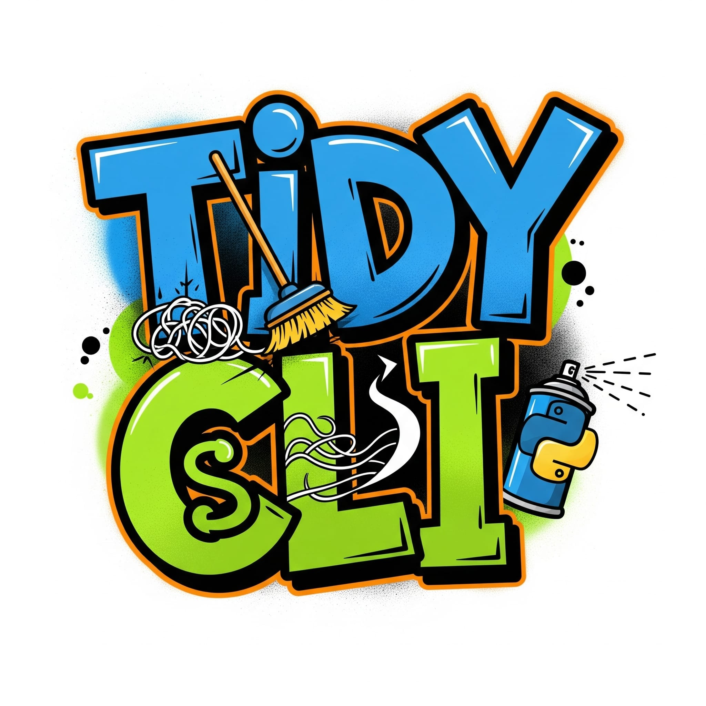

<div align="center">

  <h1>Keep your code clean and robust!</h1>
</div>

**Tidy CLI** simplifies your development process by combining essential tools like ruff, mypy, pydoclint, and pytest into a single, easy-to-use command-line interface. Perfect for maintaining code quality and running tests across Python projects of any size.

## :material-star: Key Features

- **:material-wrench: Unified Linting**: Combines ruff, mypy, and pydoclint in one command
- **:material-palette: Smart Formatting**: Automatic code formatting with ruff
- **:material-test-tube: Integrated Testing**: Run pytest with coverage reporting
- **:material-lightning-bolt: Auto-fix**: Automatically fix linting issues where possible
- **:material-refresh: Interactive Mode**: Review and apply fixes interactively
- **:material-chart-line: Flexible Execution**: Target specific files, directories, or entire projects
- **:material-cog: Configurable**: Skip tools, customize paths, and adapt to your workflow

## :material-rocket-launch: Quick Start

```bash
pip install tidy-cli  # Python 3.10+
tidy-cli init         # Setup project
tidy-cli lint run     # Check code quality
tidy-cli pytest run  # Run tests
```

## :material-book-open: Documentation Structure

- **:material-school: [Tutorials](tutorials.md)** - Step-by-step guides to get you started
- **:material-tools: [How-to Guides](how-to-guides.md)** - Practical solutions for common tasks
- **:material-book: [Reference](reference.md)** - Complete command and configuration reference
- **:material-lightbulb: [Explanation](explanation.md)** - Understanding the concepts behind Tidy CLI

## :material-heart: Contributing

Contributions are welcome! Check out our [GitHub repository](https://github.com/AlfredoCinelli/tidy-cli) to get started.

## :material-license: License

This project is licensed under the MIT License.